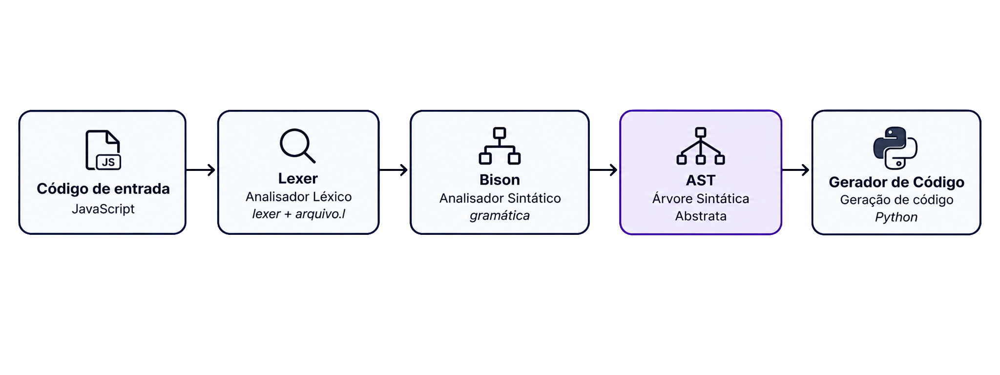

---
hide:
  - navigation
  - toc
---
# Sobre o Projeto

Este projeto tem como foco o desenvolvimento completo de um compilador, implementado de forma estruturada e incremental ao longo de várias sprints. O objetivo principal é aplicar e consolidar os conhecimentos teóricos e práticos sobre a construção de compiladores, passando pelas principais fases de tradução de uma linguagem fonte.

## Fluxo de Compilação

O fluxo de compilação especificado para a arquitetura base do projeto é composto pelas seguintes tecnologias e etapas:

1. **Analisador Léxico:** Desenvolvido utilizando o **Flex/Lexer**. É responsável por fazer a varredura e processamento do código-fonte, aplicando expressões regulares para reconhecer os componentes válidos da linguagem e gerar a sequência de tokens (lexemas).
2. **Analisador Sintático:** Implementado utilizando o **Bison**. Esta etapa recebe os tokens gerados no processo léxico, valida a correta formação das instruções de acordo com a gramática livre de contexto da linguagem e constrói a Árvore Sintática Abstrata (AST).
3. **Gerador de Código Final:** Responsável por pegar a representação estruturada, validada e possivelmente otimizada, traduzindo-a efetivamente para a linguagem alvo, resultando no código final executável.
